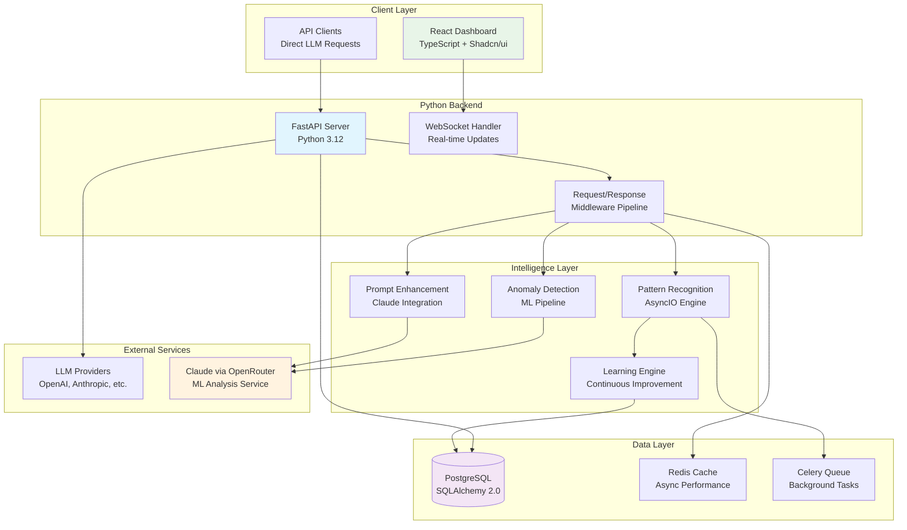

# 🐍 Intelligent LLM Proxy Ecosystem - Python Architecture

## 📋 Executive Summary

This document outlines the comprehensive Python 3.12-based architecture for the intelligent LLM proxy ecosystem. The system will serve as a sophisticated man-in-the-middle platform that intercepts, analyzes, and enhances all LLM communications while building adaptive intelligence around prompt patterns, completion behavior, and tool invocation.

## 🎯 Technology Stack Overview

### Core Technologies
- **Backend**: Python 3.12 with FastAPI
- **Database**: PostgreSQL with SQLAlchemy 2.0 + Alembic
- **Frontend**: React with TypeScript and Shadcn/ui
- **ML/AI**: Claude via OpenRouter for intelligent analysis
- **Real-time**: WebSockets with FastAPI WebSocket support
- **Caching**: Redis with async support
- **Task Queue**: Celery with Redis broker
- **Testing**: pytest with async support

### Key Python Libraries
```python
# Core Framework
fastapi = "^0.104.0"
uvicorn = "^0.24.0"
pydantic = "^2.5.0"

# Database
sqlalchemy = "^2.0.23"
alembic = "^1.13.0"
asyncpg = "^0.29.0"
psycopg2-binary = "^2.9.9"

# AI/ML Integration
openai = "^1.3.0"
anthropic = "^0.7.0"
httpx = "^0.25.0"

# Async & Performance
redis = "^5.0.1"
celery = "^5.3.4"
aiofiles = "^23.2.1"

# Security & Monitoring
python-jose = "^3.3.0"
passlib = "^1.7.4"
python-multipart = "^0.0.6"

# Development
pytest = "^7.4.3"
pytest-asyncio = "^0.21.1"
black = "^23.11.0"
ruff = "^0.1.6"
```

## 🏛️ High-Level Architecture



## 🗄️ Database Schema (SQLAlchemy Models)

### Core Models Structure

```python
# models/base.py
from sqlalchemy import Column, DateTime, String
from sqlalchemy.dialects.postgresql import UUID
from sqlalchemy.ext.declarative import declarative_base
from sqlalchemy.sql import func
import uuid

Base = declarative_base()

class BaseModel(Base):
    __abstract__ = True

    id = Column(UUID(as_uuid=True), primary_key=True, default=uuid.uuid4)
    created_at = Column(DateTime(timezone=True), server_default=func.now())
    updated_at = Column(DateTime(timezone=True), onupdate=func.now())

# models/session.py
from sqlalchemy import Column, String, JSON
from sqlalchemy.orm import relationship
from .base import BaseModel

class Session(BaseModel):
    __tablename__ = "sessions"

    session_key = Column(String, unique=True, nullable=False)
    user_id = Column(String, nullable=True)
    metadata = Column(JSON, default=dict)

    # Relationships
    requests = relationship("Request", back_populates="session")

# models/request.py
from sqlalchemy import Column, String, JSON, Integer, ForeignKey
from sqlalchemy.dialects.postgresql import UUID
from sqlalchemy.orm import relationship
from .base import BaseModel

class Request(BaseModel):
    __tablename__ = "requests"

    session_id = Column(UUID(as_uuid=True), ForeignKey("sessions.id"))
    model = Column(String, nullable=False)
    messages = Column(JSON, nullable=False)
    tools = Column(JSON, default=list)
    parameters = Column(JSON, default=dict)
    target_url = Column(String, nullable=False)
    headers = Column(JSON, default=dict)
    status = Column(String, default="pending")
    response_time_ms = Column(Integer, nullable=True)
    namespace_prefix = Column(String, nullable=True)

    # Relationships
    session = relationship("Session", back_populates="requests")
    response = relationship("Response", back_populates="request", uselist=False)
    enhancements = relationship("Enhancement", back_populates="request")
    anomalies = relationship("Anomaly", back_populates="request")

# models/response.py
from sqlalchemy import Column, JSON, Integer, Boolean, ForeignKey
from sqlalchemy.dialects.postgresql import UUID
from sqlalchemy.orm import relationship
from .base import BaseModel

class Response(BaseModel):
    __tablename__ = "responses"

    request_id = Column(UUID(as_uuid=True), ForeignKey("requests.id"))
    content = Column(JSON, nullable=False)
    tool_calls = Column(JSON, default=list)
    usage_stats = Column(JSON, default=dict)
    status_code = Column(Integer, nullable=False)
    headers = Column(JSON, default=dict)
    is_streaming = Column(Boolean, default=False)
    total_tokens = Column(Integer, nullable=True)
    cost_estimate = Column(Integer, nullable=True)  # in cents

    # Relationships
    request = relationship("Request", back_populates="response")

# models/pattern.py
from sqlalchemy import Column, String, JSON, Integer, Float
from .base import BaseModel

class PromptPattern(BaseModel):
    __tablename__ = "prompt_patterns"

    pattern_hash = Column(String, unique=True, nullable=False)
    pattern_data = Column(JSON, nullable=False)
    frequency_count = Column(Integer, default=1)
    success_rate = Column(Float, default=0.0)
    enhancement_suggestions = Column(JSON, default=list)
    pattern_type = Column(String, nullable=True)
    metadata = Column(JSON, default=dict)

    # Relationships
    enhancements = relationship("Enhancement", back_populates="pattern")

# models/enhancement.py
from sqlalchemy import Column, String, JSON, Boolean, Float, ForeignKey
from sqlalchemy.dialects.postgresql import UUID
from sqlalchemy.orm import relationship
from .base import BaseModel

class Enhancement(BaseModel):
    __tablename__ = "enhancements"

    request_id = Column(UUID(as_uuid=True), ForeignKey("requests.id"))
    pattern_id = Column(UUID(as_uuid=True), ForeignKey("prompt_patterns.id"), nullable=True)
    enhancement_type = Column(String, nullable=False)
    original_prompt = Column(JSON, nullable=False)
    enhanced_prompt = Column(JSON, nullable=False)
    enhancement_metadata = Column(JSON, default=dict)
    was_applied = Column(Boolean, default=False)
    effectiveness_score = Column(Float, nullable=True)
    source_engine = Column(String, default="claude")

    # Relationships
    request = relationship("Request", back_populates="enhancements")
    pattern = relationship("PromptPattern", back_populates="enhancements")

# models/anomaly.py
from sqlalchemy import Column, String, Float, JSON, Boolean, DateTime, ForeignKey
from sqlalchemy.dialects.postgresql import UUID
from sqlalchemy.orm import relationship
from .base import BaseModel

class Anomaly(BaseModel):
    __tablename__ = "anomalies"

    request_id = Column(UUID(as_uuid=True), ForeignKey("requests.id"))
    anomaly_type = Column(String, nullable=False)
    severity_score = Column(Float, nullable=False)
    detection_metadata = Column(JSON, default=dict)
    status = Column(String, default="detected")
    resolution_data = Column(JSON, default=dict)
    detected_at = Column(DateTime(timezone=True), nullable=False)
    resolved_at = Column(DateTime(timezone=True), nullable=True)
    auto_blocked = Column(Boolean, default=False)

    # Relationships
    request = relationship("Request", back_populates="anomalies")

# models/security.py
from sqlalchemy import Column, String, JSON, Boolean, Integer
from .base import BaseModel

class SecurityPolicy(BaseModel):
    __tablename__ = "security_policies"

    policy_name = Column(String, unique=True, nullable=False)
    policy_type = Column(String, nullable=False)
    rules = Column(JSON, nullable=False)
    is_active = Column(Boolean, default=True)
    priority = Column(Integer, default=100)
    created_by = Column(String, nullable=True)

class Transformation(BaseModel):
    __tablename__ = "transformations"

    rule_name = Column(String, unique=True, nullable=False)
    trigger_condition = Column(String, nullable=False)
    transformation_logic = Column(JSON, nullable=False)
    is_active = Column(Boolean, default=True)
    execution_order = Column(Integer, default=100)
    usage_count = Column(Integer, default=0)

# models/analytics.py
from sqlalchemy import Column, String, JSON, ForeignKey
from sqlalchemy.dialects.postgresql import UUID
from .base import BaseModel

class AnalyticsEvent(BaseModel):
    __tablename__ = "analytics_events"

    event_type = Column(String, nullable=False)
    related_id = Column(UUID(as_uuid=True), nullable=True)
    event_data = Column(JSON, default=dict)
    source_component = Column(String, nullable=False)
```

## 🔧 Core Python Components

### 1. FastAPI Application Structure (`app/`)

#### **Main Application** (`main.py`)
```python
from fastapi import FastAPI, Request, Response
from fastapi.middleware.cors import CORSMiddleware
from fastapi.middleware.gzip import GZipMiddleware
from contextlib import asynccontextmanager
import uvicorn

from app.core.config import settings
from app.core.database import init_db
from app.api.routes import api_router
from app.middleware.proxy import ProxyMiddleware
from app.middleware.intelligence import IntelligenceMiddleware
from app.middleware.security import SecurityMiddleware
from app.websocket.manager import WebSocketManager

@asynccontextmanager
async def lifespan(app: FastAPI):
    # Startup
    await init_db()
    app.state.websocket_manager = WebSocketManager()
    yield
    # Shutdown
    pass

app = FastAPI(
    title="Intelligent LLM Proxy",
    description="AI-powered LLM proxy with pattern learning and enhancement",
    version="1.0.0",
    lifespan=lifespan
)

# Middleware
app.add_middleware(GZipMiddleware, minimum_size=1000)
app.add_middleware(
    CORSMiddleware,
    allow_origins=settings.ALLOWED_HOSTS,
    allow_credentials=True,
    allow_methods=["*"],
    allow_headers=["*"],
)

# Custom middleware
app.add_middleware(SecurityMiddleware)
app.add_middleware(IntelligenceMiddleware)
app.add_middleware(ProxyMiddleware)

# Routes
app.include_router(api_router, prefix="/api/v1")

if __name__ == "__main__":
    uvicorn.run(
        "app.main:app",
        host="0.0.0.0",
        port=settings.PORT,
        reload=settings.DEBUG,
        log_level="info"
    )
```

#### **Proxy Handler** (`proxy/handler.py`)
```python
from fastapi import Request, Response, HTTPException
from typing import Dict, Any, Optional
import httpx
import asyncio
import json
import time
from urllib.parse import urlparse

from app.core.database import get_db
from app.models.request import Request as RequestModel
from app.models.response import Response as ResponseModel
from app.services.intelligence import IntelligenceService
from app.services.security import SecurityService
from app.services.namespace import NamespaceService
from app.utils.logger import logger

class ProxyHandler:
    def __init__(self):
        self.intelligence_service = IntelligenceService()
        self.security_service = SecurityService()
        self.namespace_service = NamespaceService()

    async def handle_request(
        self,
        request: Request,
        target_url: str,
        session_id: str
    ) -> Response:
        """Handle incoming LLM proxy request"""
        start_time = time.time()

        try:
            # Parse and validate request
            request_data = await self._parse_request(request)

            # Security check
            security_result = await self.security_service.validate_request(
                request_data, session_id
            )
            if not security_result.is_safe:
                raise HTTPException(
                    status_code=403,
                    detail=f"Security violation: {security_result.reason}"
                )

            # Apply namespace prefixes
            request_data = await self.namespace_service.apply_prefixes(
                request_data, session_id
            )

            # Intelligence analysis and enhancement
            enhanced_data = await self.intelligence_service.enhance_request(
                request_data, session_id
            )

            # Log request to database
            db_request = await self._log_request(
                enhanced_data, target_url, session_id, start_time
            )

            # Forward to LLM provider
            response_data = await self._forward_request(
                enhanced_data, target_url, request.headers
            )

            # Process response
            processed_response = await self._process_response(
                response_data, db_request.id
            )

            # Update intelligence with success metrics
            await self.intelligence_service.update_success_metrics(
                db_request.id, processed_response
            )

            return processed_response

        except Exception as e:
            logger.error(f"Proxy error: {str(e)}")
            await self._log_error(session_id, str(e))
            raise HTTPException(status_code=500, detail="Proxy processing error")

    async def _parse_request(self, request: Request) -> Dict[str, Any]:
        """Parse incoming request data"""
        try:
            body = await request.body()
            return json.loads(body.decode())
        except json.JSONDecodeError:
            raise HTTPException(status_code=400, detail="Invalid JSON in request")

    async def _forward_request(
        self,
        data: Dict[str, Any],
        target_url: str,
        headers: Dict[str, str]
    ) -> Dict[str, Any]:
        """Forward request to LLM provider"""
        async with httpx.AsyncClient(timeout=30.0) as client:
            # Prepare headers
            forward_headers = {
                k: v for k, v in headers.items()
                if k.lower() not in ['host', 'content-length']
            }

            response = await client.post(
                target_url,
                json=data,
                headers=forward_headers
            )

            if response.status_code != 200:
                raise HTTPException(
                    status_code=response.status_code,
                    detail=f"LLM provider error: {response.text}"
                )

            return response.json()

    async def _log_request(
        self,
        data: Dict[str, Any],
        target_url: str,
        session_id: str,
        start_time: float
    ) -> RequestModel:
        """Log request to database"""
        async with get_db() as db:
            db_request = RequestModel(
                session_id=session_id,
                model=data.get("model", "unknown"),
                messages=data.get("messages", []),
                tools=data.get("tools", []),
                parameters={k: v for k, v in data.items()
                           if k not in ["messages", "tools", "model"]},
                target_url=target_url,
                status="processing"
            )
            db.add(db_request)
            await db.commit()
            await db.refresh(db_request)
            return db_request
```

### 2. Intelligence Engine (`services/intelligence.py`)

```python
from typing import Dict, Any, List, Optional
import hashlib
import json
import asyncio
from datetime import datetime, timedelta

from app.core.database import get_db
from app.models.pattern import PromptPattern
from app.models.enhancement import Enhancement
from app.services.claude import ClaudeService
from app.utils.pattern_analyzer import PatternAnalyzer
from app.utils.logger import logger

class IntelligenceService:
    def __init__(self):
        self.claude_service = ClaudeService()
        self.pattern_analyzer = PatternAnalyzer()

    async def enhance_request(
        self,
        request_data: Dict[str, Any],
        session_id: str
    ) -> Dict[str, Any]:
        """Enhance request using pattern recognition and AI"""
        try:
            # Analyze prompt patterns
            patterns = await self._analyze_patterns(request_data)

            # Get enhancement suggestions
            enhancements = await self._get_enhancements(
                request_data, patterns, session_id
            )

            # Apply best enhancements
            enhanced_data = await self._apply_enhancements(
                request_data, enhancements
            )

            return enhanced_data

        except Exception as e:
            logger.error(f"Enhancement error: {str(e)}")
            return request_data  # Return original on error

    async def _analyze_patterns(
        self,
        request_data: Dict[str, Any]
    ) -> List[PromptPattern]:
        """Analyze request for known patterns"""
        messages = request_data.get("messages", [])
        pattern_hash = self._generate_pattern_hash(messages)

        async with get_db() as db:
            # Check for existing patterns
            existing_pattern = await db.query(PromptPattern).filter(
                PromptPattern.pattern_hash == pattern_hash
            ).first()

            if existing_pattern:
                # Update frequency
                existing_pattern.frequency_count += 1
                await db.commit()
                return [existing_pattern]

            # Create new pattern
            pattern_data = self.pattern_analyzer.extract_features(messages)
            new_pattern = PromptPattern(
                pattern_hash=pattern_hash,
                pattern_data=pattern_data,
                pattern_type=self.pattern_analyzer.classify_pattern(messages)
            )

            db.add(new_pattern)
            await db.commit()
            return [new_pattern]

    async def _get_enhancements(
        self,
        request_data: Dict[str, Any],
        patterns: List[PromptPattern],
        session_id: str
    ) -> List[Dict[str, Any]]:
        """Get enhancement suggestions from Claude"""
        enhancements = []

        for pattern in patterns:
            if pattern.success_rate < 0.8:  # Only enhance low-success patterns
                claude_enhancement = await self.claude_service.suggest_enhancement(
                    request_data, pattern, session_id
                )
                if claude_enhancement:
                    enhancements.append(claude_enhancement)

        return enhancements

    async def _apply_enhancements(
        self,
        request_data: Dict[str, Any],
        enhancements: List[Dict[str, Any]]
    ) -> Dict[str, Any]:
        """Apply selected enhancements to request"""
        enhanced_data = request_data.copy()

        for enhancement in enhancements:
            if enhancement.get("confidence", 0) > 0.7:
                # Apply high-confidence enhancements
                enhanced_data = self._merge_enhancement(
                    enhanced_data, enhancement
                )

        return enhanced_data

    def _generate_pattern_hash(self, messages: List[Dict[str, Any]]) -> str:
        """Generate hash for message pattern"""
        pattern_str = json.dumps(
            [{"role": msg.get("role"), "type": type(msg.get("content")).__name__}
             for msg in messages],
            sort_keys=True
        )
        return hashlib.sha256(pattern_str.encode()).hexdigest()

    async def update_success_metrics(
        self,
        request_id: str,
        response_data: Dict[str, Any]
    ) -> None:
        """Update pattern success metrics based on response"""
        # Implementation for updating success rates
        pass
```

### 3. Claude Integration (`services/claude.py`)

```python
import asyncio
import json
from typing import Dict, Any, Optional
import httpx

from app.core.config import settings
from app.models.pattern import PromptPattern
from app.utils.logger import logger

class ClaudeService:
    def __init__(self):
        self.api_key = settings.OPENROUTER_API_KEY
        self.base_url = "https://openrouter.ai/api/v1"
        self.model = "anthropic/claude-3-sonnet"

    async def suggest_enhancement(
        self,
        request_data: Dict[str, Any],
        pattern: PromptPattern,
        session_id: str
    ) -> Optional[Dict[str, Any]]:
        """Get enhancement suggestion from Claude"""
        try:
            analysis_prompt = self._build_analysis_prompt(
                request_data, pattern
            )

            response = await self._call_claude(analysis_prompt)
            enhancement = self._parse_enhancement_response(response)

            return enhancement

        except Exception as e:
            logger.error(f"Claude enhancement error: {str(e)}")
            return None

    async def detect_anomaly(
        self,
        request_data: Dict[str, Any]
    ) -> Dict[str, Any]:
        """Detect anomalies using Claude"""
        try:
            anomaly_prompt = self._build_anomaly_prompt(request_data)
            response = await self._call_claude(anomaly_prompt)
            return self._parse_anomaly_response(response)

        except Exception as e:
            logger.error(f"Claude anomaly detection error: {str(e)}")
            return {"is_anomaly": False, "confidence": 0.0}

    async def _call_claude(self, prompt: str) -> str:
        """Make API call to Claude via OpenRouter"""
        async with httpx.AsyncClient() as client:
            response = await client.post(
                f"{self.base_url}/chat/completions",
                headers={
                    "Authorization": f"Bearer {self.api_key}",
                    "Content-Type": "application/json"
                },
                json={
                    "model": self.model,
                    "messages": [
                        {
                            "role": "user",
                            "content": prompt
                        }
                    ],
                    "max_tokens": 1000,
                    "temperature": 0.3
                }
            )

            if response.status_code != 200:
                raise Exception(f"Claude API error: {response.text}")

            result = response.json()
            return result["choices"][0]["message"]["content"]

    def _build_analysis_prompt(
        self,
        request_data: Dict[str, Any],
        pattern: PromptPattern
    ) -> str:
        """Build prompt for enhancement analysis"""
        return f"""
        Analyze this LLM request and suggest improvements:

        Request: {json.dumps(request_data, indent=2)}
        Pattern Success Rate: {pattern.success_rate}
        Pattern Frequency: {pattern.frequency_count}

        Provide enhancement suggestions in JSON format:
        {{
            "enhancements": [
                {{
                    "type": "prompt_clarification|context_addition|structure_improvement",
                    "description": "What to improve",
                    "suggested_change": "Specific change to make",
                    "confidence": 0.0-1.0,
                    "reasoning": "Why this helps"
                }}
            ]
        }}
        """

    def _build_anomaly_prompt(self, request_data: Dict[str, Any]) -> str:
        """Build prompt for anomaly detection"""
        return f"""
        Analyze this LLM request for potential security issues or anomalies:

        Request: {json.dumps(request_data, indent=2)}

        Check for:
        - Prompt injection attempts
        - Unusual patterns
        - Potential data exfiltration
        - Abuse patterns

        Respond in JSON format:
        {{
            "is_anomaly": true/false,
            "anomaly_type": "prompt_injection|data_exfiltration|abuse|unusual_pattern",
            "confidence": 0.0-1.0,
            "reasoning": "Why this is flagged",
            "severity": "low|medium|high|critical"
        }}
        """
```

### 4. WebSocket Manager (`websocket/manager.py`)

```python
from fastapi import WebSocket, WebSocketDisconnect
from typing import Dict, List, Any
import json
import asyncio
from datetime import datetime

from app.utils.logger import logger

class WebSocketManager:
    def __init__(self):
        self.active_connections: Dict[str, List[WebSocket]] = {}
        self.connection_metadata: Dict[WebSocket, Dict[str, Any]] = {}

    async def connect(self, websocket: WebSocket, session_id: str):
        """Connect a new WebSocket client"""
        await websocket.accept()

        if session_id not in self.active_connections:
            self.active_connections[session_id] = []

        self.active_connections[session_id].append(websocket)
        self.connection_metadata[websocket] = {
            "session_id": session_id,
            "connected_at": datetime.utcnow(),
            "last_ping": datetime.utcnow()
        }

        logger.info(f"WebSocket connected for session: {session_id}")

    def disconnect(self, websocket: WebSocket):
        """Disconnect a WebSocket client"""
        metadata = self.connection_metadata.get(websocket)
        if metadata:
            session_id = metadata["session_id"]
            if session_id in self.active_connections:
                self.active_connections[session_id].remove(websocket)
                if not self.active_connections[session_id]:
                    del self.active_connections[session_id]

            del self.connection_metadata[websocket]
            logger.info(f"WebSocket disconnected for session: {session_id}")

    async def send_to_session(
        self,
        session_id: str,
        message: Dict[str, Any]
    ):
        """Send message to all connections for a session"""
        if session_id in self.active_connections:
            message_str = json.dumps(message)
            disconnected = []

            for websocket in self.active_connections[session_id]:
                try:
                    await websocket.send_text(message_str)
                except WebSocketDisconnect:
                    disconnected.append(websocket)
                except Exception as e:
                    logger.error(f"WebSocket send error: {str(e)}")
                    disconnected.append(websocket)

            # Clean up disconnected clients
            for websocket in disconnected:
                self.disconnect(websocket)

    async def broadcast(self, message: Dict[str, Any]):
        """Broadcast message to all connected clients"""
        message_str = json.dumps(message)
        disconnected = []

        for websocket in self.connection_metadata.keys():
            try:
                await websocket.send_text(message_str)
            except WebSocketDisconnect:
                disconnected.append(websocket)
            except Exception as e:
                logger.error(f"WebSocket broadcast error: {str(e)}")
                disconnected.append(websocket)

        # Clean up disconnected clients
        for websocket in disconnected:
            self.disconnect(websocket)

    async def send_real_time_update(
        self,
        session_id: str,
        update_type: str,
        data: Dict[str, Any]
    ):
        """Send real-time update to session"""
        message = {
            "type": update_type,
            "timestamp": datetime.utcnow().isoformat(),
            "data": data
        }
        await self.send_to_session(session_id, message)
```

## 📁 Complete Python Project Structure

```
llm-proxy-python/
├── app/
│   ├── __init__.py
│   ├── main.py                          # FastAPI application
│   ├── core/
│   │   ├── __init__.py
│   │   ├── config.py                    # Configuration management
│   │   ├── database.py                  # Database connection
│   │   ├── security.py                  # Security utilities
│   │   └── exceptions.py                # Custom exceptions
│   ├── models/
│   │   ├── __init__.py
│   │   ├── base.py                      # Base model class
│   │   ├── session.py                   # Session model
│   │   ├── request.py                   # Request model
│   │   ├── response.py                  # Response model
│   │   ├── pattern.py                   # Pattern model
│   │   ├── enhancement.py               # Enhancement model
│   │   ├── anomaly.py                   # Anomaly model
│   │   ├── security.py                  # Security models
│   │   └── analytics.py                 # Analytics models
│   ├── api/
│   │   ├── __init__.py
│   │   ├── routes/
│   │   │   ├── __init__.py
│   │   │   ├── proxy.py                 # Proxy endpoints
│   │   │   ├── analytics.py             # Analytics endpoints
│   │   │   ├── patterns.py              # Pattern endpoints
│   │   │   ├── security.py              # Security